# 🛒 Liste des Courses - Application Mobile

## 📌 Contexte du Projet

Dans un monde où l'organisation et la gestion des tâches quotidiennes deviennent de plus en plus essentielles, **Liste des Courses** a été développée pour simplifier l'expérience des utilisateurs lors de leurs achats.

L'application permet de **créer, organiser et partager des listes de courses** en toute simplicité. Plus besoin d'oubli ou de papier perdu ! Grâce à une **synchronisation en temps réel** via **Firebase**, les utilisateurs peuvent modifier leurs listes et y accéder depuis n'importe où.

Que ce soit pour une utilisation personnelle, en famille ou en colocation, **Liste des Courses** propose une interface intuitive qui optimise le **temps passé en magasin** et **évite les achats inutiles**.

Avec ses fonctionnalités avancées, telles que **la gestion des produits par catégorie**, **les suggestions intelligentes basées sur les habitudes d'achat** et **le partage en temps réel**, cette application devient l'alliée idéale pour une meilleure organisation des courses.

🔥 **Objectif :** Offrir aux utilisateurs une solution efficace et moderne pour gérer leurs listes d’achats et simplifier leur quotidien !

---

## 🚀 Fonctionnalités Principales  

✅ **Création et gestion des listes**  
- Ajout, modification et suppression d'articles dans une liste de courses.  
- Organisation des produits par catégorie (fruits, légumes, produits laitiers, etc.).  

✅ **Partage des listes**  
- Possibilité de partager une liste avec d'autres utilisateurs en temps réel.  

✅ **Suggestions intelligentes**  
- Recommandations basées sur les habitudes d'achat.  
- Ajout rapide des articles fréquemment achetés.  

✅ **Mode hors-ligne**  
- Gestion des listes même sans connexion Internet.  

✅ **Interface intuitive**  
- Design ergonomique et facile à utiliser.  
- Thème clair et sombre disponible.  

---

## 🛠 Technologies Utilisées  

🔹 **Backend & Base de Données** : Firebase (Storage, Authentication, Cloud Firestore, Realtime Database)  
🔹 **Frontend & Développement Mobile** : Java, Android Studio, XML  
🔹 **APIs & Réseaux** : Retrofit (requêtes HTTP), Gson (JSON Parsing)  
🔹 **Gestion des Médias** : Picasso (chargement des images)  

---

## 📲 Captures d'Écran  

### 🔑 connexion et enregistrement

| In1 | In2 | in3 |
|---------|----------------------|----------------------|
 |  | 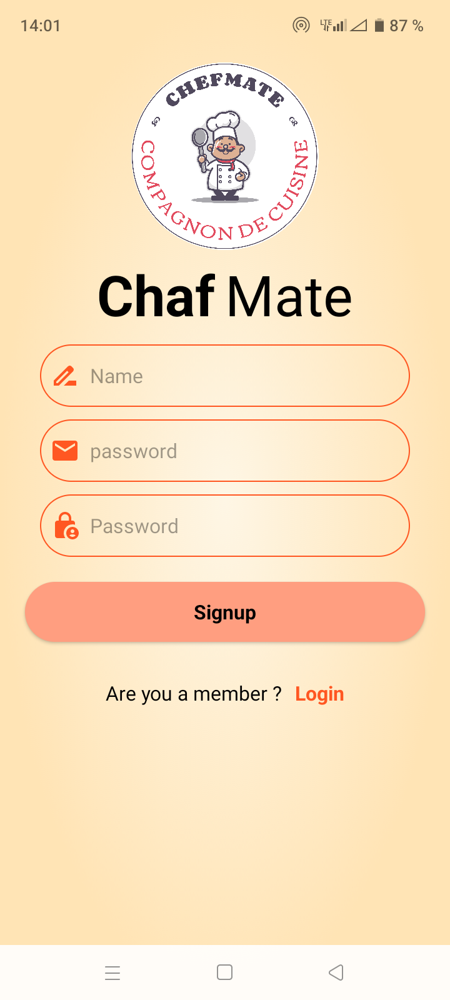

### 🏠 Écran d'Accueil  

| Accueil 1 | Accueil 2 | Accueil 3 |
|---------|------------------|------------------|
| 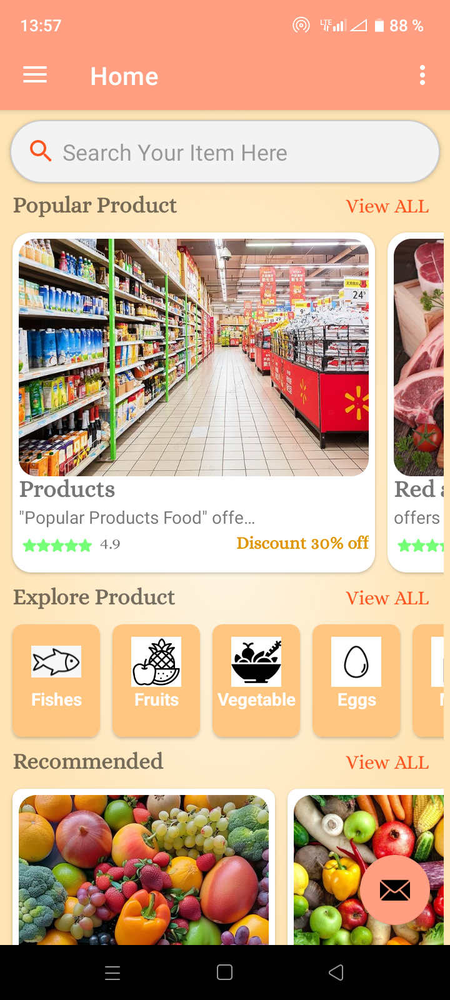 |  | 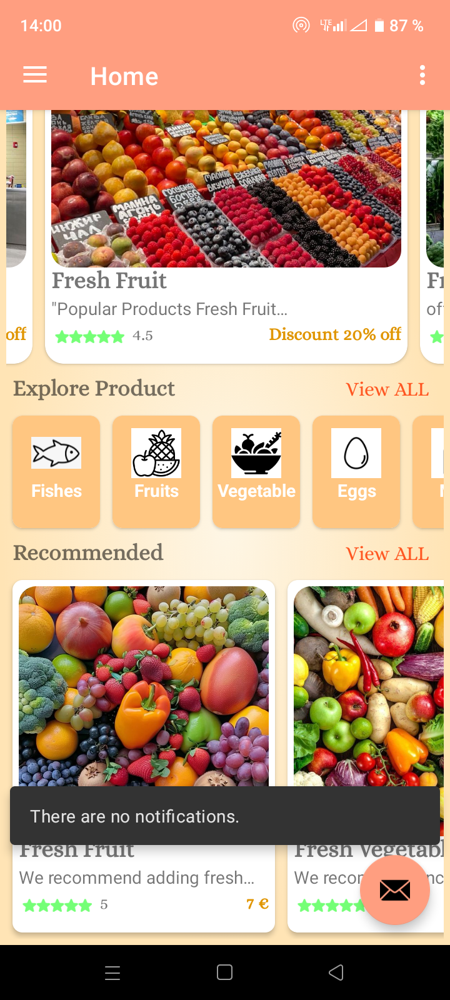 |

### 📖 Les Produits

| In1 | In2 | In3 |
|---------|----------------------|----------------------|
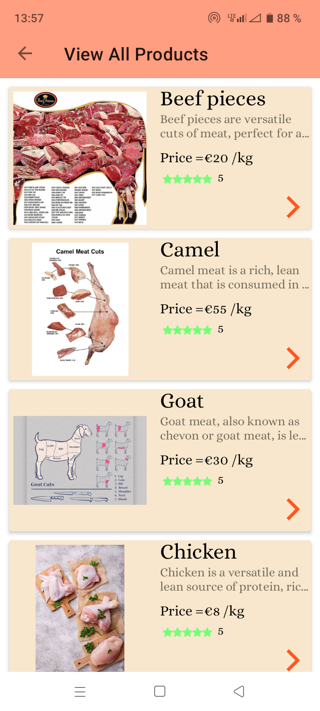 | 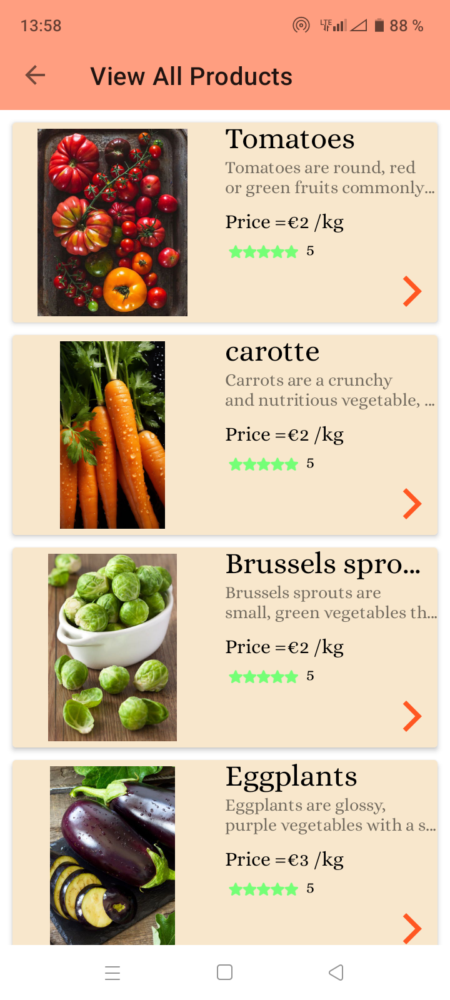 | 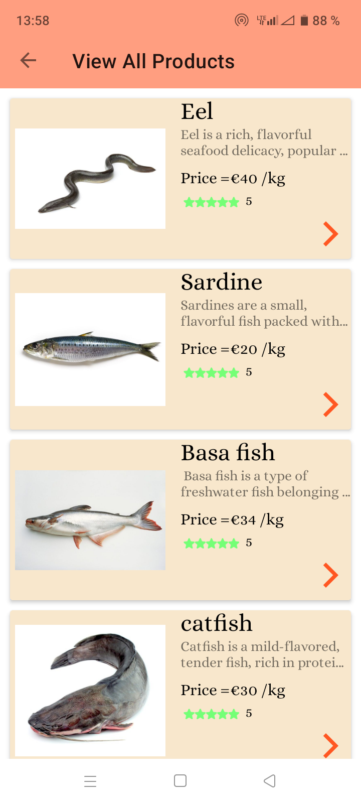

### 📌 Barre De Navigation  

| Navigation | Interface profile | Interface Catégories |
|---------|------------------|------------------|
| 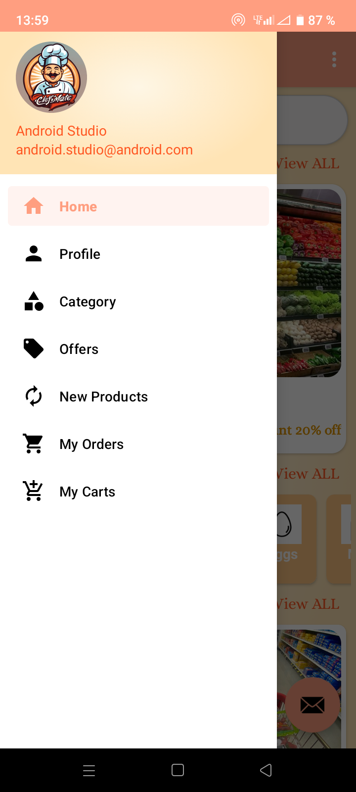 | 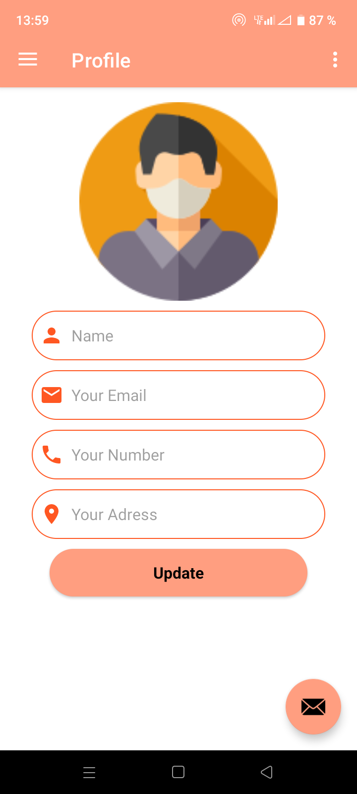 | 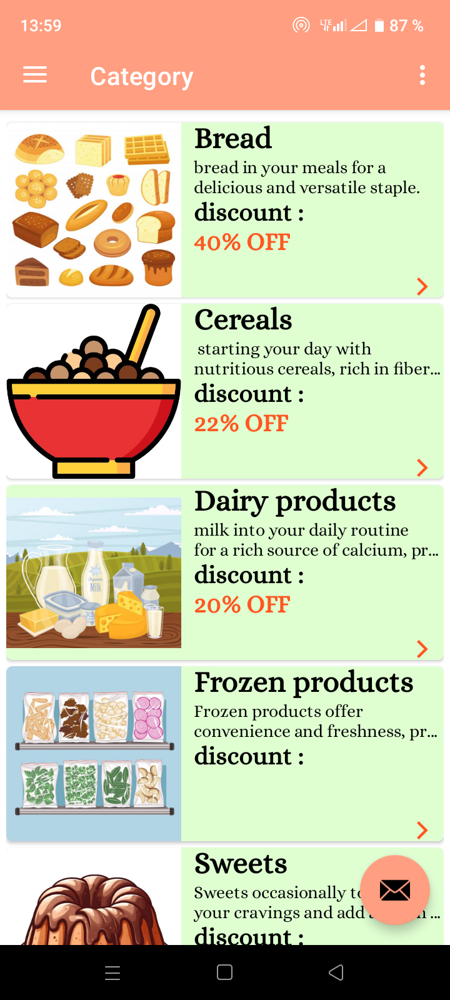 |

### 📋 Gestion des Listes  

| Mon Chariot | Mes Commandes | Nouveaux Produits |
|------------------|--------------------|------------------|
| 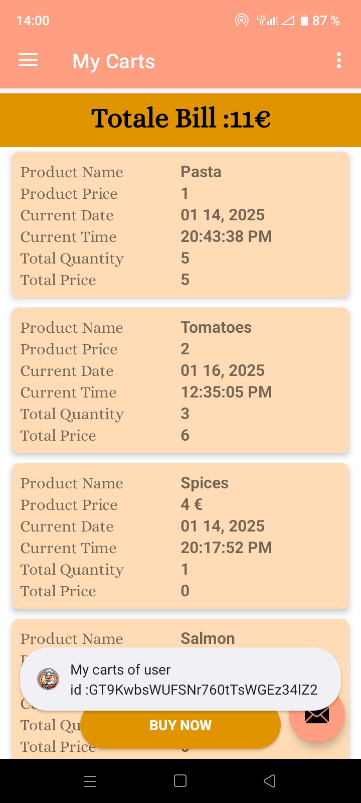 | 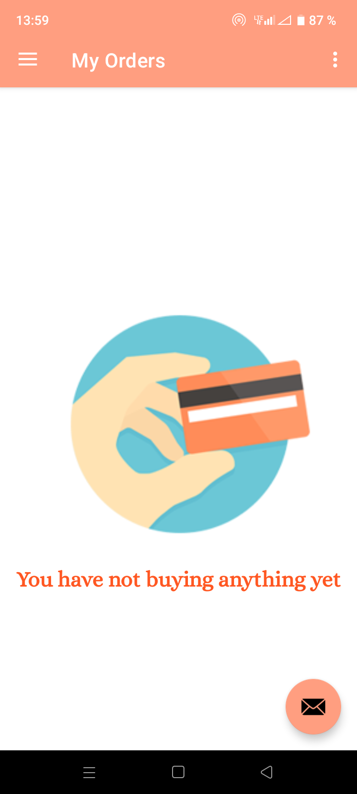 | 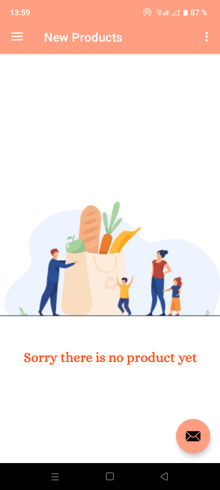 |

---

## Vidéo de Présentation

🎥 [Voir la vidéo de présentation Cliquez ici](https://drive.google.com/file/d/1GldkgduyCsms0uyCwzus27wffzp5_uOQ/view?usp=sharing)

---

📩 Contactez-moi pour toute suggestion ou collaboration !
